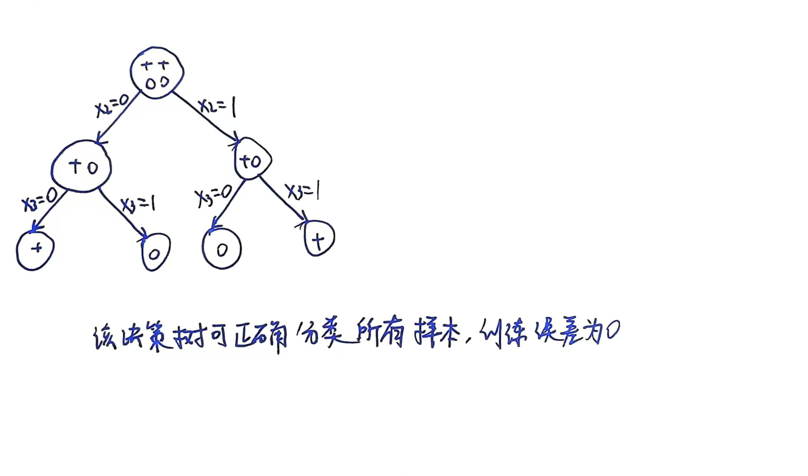

# Homework 2 Report

## 一
### 1
数据量较小的场景：K折交叉验证特别适合数据集较小的情况，因为它能够最大限度地利用有限的数据进行训练和验证。

模型选择和评估：在模型的选择过程中，如果我们需要评估不同模型或不同参数配置的性能，K折交叉验证可以提供较为稳定和可靠的结果。

K越大，每个验证集的样本会少，这会导致每次模型的误差估计更加不稳定，因为验证集的误差受数据点的影响更大。所以并不是K越大越好。

### 2
通过基函数将原始特征映射到高维空间，使线性模型能够拟合非线性模式。例如，多项式回归通过添加x\^2,x\^3等项实现曲线拟合。

基函数过于复杂可能会出现过拟合现象，在训练集上表现优异，但测试集上性能骤降，所以学习效果不一定越好。

### 3
1. 每棵决策树在训练时，从原始数据集中有放回地随机抽取样本，形成不同的训练子集。通过数据扰动减少模型对特定样本的过拟合风险。
2. 在每棵树的节点分裂时，从所有特征中随机选取一个特征子集，仅在该子集中寻找最优分裂点。这种方法避免了决策树每次都选择相同的特征进行分裂，使模型能挖掘更多潜在规律。

### 4
蒙特卡洛策略使用整个回合的实际回报来计算梯度。在一个回合中，从时间步 t 之后发生的任何事情——无论是策略本身的随机性还是环境的随机性——都会影响最终的回报。这意味着，即使在同一个状态执行了同一个动作，在不同的回合中得到的回报值可能会有巨大的差异。用这样一个波动剧烈的、单一样本的回报值来指导策略更新，其梯度估计的方差自然就很高。

演员-评论家方法使用评论家学习到的价值估计来代替蒙特卡洛方法中的实际回报，评论家学习的价值函数 Q(s,a,w)本身就是对期望回报的估计，它是在大量经验上学习得到的平均概念，而不是单次回合的随机结果。这天然就比单次采样的回报要平滑。另外，评论家通常使用时间差分 (TD) 学习来更新，TD 学习的更新目标通常只依赖于下一步的即时奖励和下一步状态的价值估计。相比于 MC 方法依赖于从 t+1 到回合结束的所有奖励，TD 方法的更新目标只与下一步的随机性有关，大大减少了随机因素的来源，因此方差更小。

### 5
1. 神经网络本身就是对真实 Q* 函数的近似，存在表示误差。
2. 强化学习的训练数据是按时间顺序产生的，导致样本之间存在高度相关性，这破坏了通常用于训练神经网络的独立同分布假设，使得学习不稳定。
3. Q 学习使用当前对未来价值的估计来更新当前的价值估计，当使用神经网络时，这个用来计算更新目标的网络本身也在不断变化，导致Q 学习的目标值本身就是不稳定的，让网络去拟合一个持续移动的目标是非常困难的。

基于策略的方法通常不能保证收敛到全局最优策略，而是保证收敛到局部最优策略。

## 二
### 1

### 2

## 三
### 1
损失函数如下：
$L_{value}=\frac{1}{B}(z-v)^T(z-v)$
$v=tanh(a)$
$a=Xw_v+b_v1_b$

对损失函数及后续变量求偏导：
$∂L / ∂v=-\frac{2}{B}(z-v)$
$∂v / ∂a= diag(1-v^2)$
$∂a / ∂w_v=X$
$∇w_vL_{value}=(∂L / ∂v) * (∂v / ∂a) * (∂a/ ∂w_v)=-\frac{2}{B}X^T[(z-v)\odot (1-v^2)]$

$∂a / ∂b_v=1_b$
$∇b_vL_{value}=(∂L / ∂v) * (∂v / ∂a) * (∂a/ ∂b_v)=-\frac{2}{B}1_b^T[(z-v)\odot (1-v^2)]$

### 2
验证正确：

